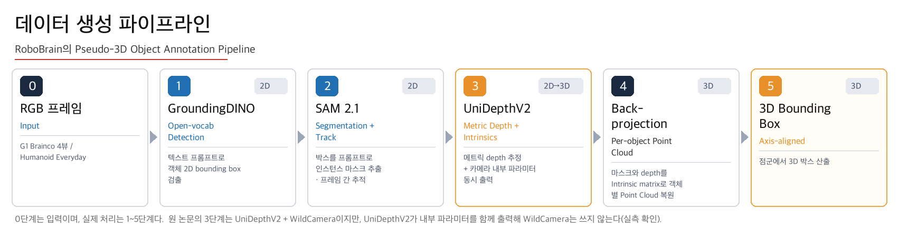

# Unitree G1 데이터셋 3D Bounding Box 추출 파이프라인

로봇 조작 영상에서 **대상 물체의 3D Bounding Box를 자동으로 생성**한다.
RoboBrain의 Pseudo-3D Object Annotation Pipeline을 Unitree G1 데이터셋 2종에 적용했다.



## 레포 구조 — 한눈에

```
task3-3dbbox-pipeline/
├── pipeline/   5단계 파이프라인 뼈대 코드 (이전 task에서 구축)
├── results/    파이프라인 최종 실행 결과 — 15태스크 39유닛 통계·이미지
├── tasks/      신규 task 8종 — task별 코드 + 육안 검증 통과 결과물
├── docs/       보고서(docx 2편)·설계 문서
└── README.md   (이 문서)
```

| 폴더 | 무엇이 있나 |
|---|---|
| [`pipeline/`](pipeline/) | 5단계 구현 본체. `track3d.py`(추적·게이트), `geometry.py`(역투영·3D박스), `models_wrap.py`(모델 래퍼), `postprocess.py`(2D박스 출력·ghost 트리밍), 러너 2종 |
| [`results/`](results/) | `최종결과/`(검증 39유닛) + `최종결과_ghost트리밍/`(유령 박스 제거 후처리 적용본). 영상은 용량 문제로 드라이브 공유, 저장소엔 통계·이미지 |
| [`tasks/`](tasks/) | 아래 신규 task 8종. **각 폴더의 README부터 읽으면 된다** |
| [`docs/`](docs/) | 구축 보고서·신규task 진행 보고서(docx), 설계·설정·개선이력 문서 |

## 신규 task 8종 (2026-08)

각 폴더에 문제상황 → 방법 → 결과를 담은 README와 산출물이 있다.
샘플 이미지는 전부 **육안 검증을 통과한 것만** 남겼다(후보 ~100장 전량 렌더 후 판정).

| # | task | 상태 | 폴더 |
|---|---|---|---|
| ① | 2D bounding box 출력 | ✅ 완료 | [`tasks/1_2D박스출력/`](tasks/1_2D박스출력/) |
| ② | 각 모듈 최신 모델 교체 | ⏸ 대기 (조사 완료) | [`tasks/2_모델교체_조사/`](tasks/2_모델교체_조사/) |
| ③ | 데이터셋 정보 분리·입력 대체 검토 | 🔶 진행 중 | [`tasks/3_데이터셋정보_분리/`](tasks/3_데이터셋정보_분리/) |
| ④ | 큰 객체(table 등) 검출 + VLM 프롬프트 | 🔶 진행 중 | [`tasks/4_큰객체/`](tasks/4_큰객체/) |
| ⑤ | Gripper/Hand Segmentation | ✅ 완료 | [`tasks/5_그리퍼분할/`](tasks/5_그리퍼분할/) |
| ⑥ | 모듈별 베스트/워스트 사례 | ✅ 완료 | [`tasks/6_모듈별_베스트워스트/`](tasks/6_모듈별_베스트워스트/) |
| ⑦ | Ghost(유령 박스) 현상 해결 | 🔶 진행 중 | [`tasks/7_ghost개선/`](tasks/7_ghost개선/) |
| ⑧ | HE G1/H1 로봇별 차이 | ✅ 완료 | [`tasks/8_G1_H1비교/`](tasks/8_G1_H1비교/) |

공용 실험 도구(소형 실험·정지컷 추출·샘플 렌더)는 [`tasks/도구/`](tasks/도구/)에 있다.
진행 경과 보고서: [Task3_신규task_진행보고.docx](docs/Task3_신규task_진행보고.docx)

---

## 파이프라인 — 무엇을 하는가

입력은 로봇이 촬영한 RGB 영상이고, 출력은 **프레임마다 대상 물체를 감싸는 3D 박스**다.
사람이 라벨을 달지 않아도 텍스트 프롬프트("oreo snack package")만으로 동작한다.

| 대상 데이터셋 | 규모 | 특징 |
|---|---|---|
| **G1 Brainco** | 8 태스크 / 1,598 에피소드 | 카메라 4대(머리 좌우 + 손목 좌우), depth 없음 → **추정** |
| **Humanoid Everyday(HE)** | 246 태스크 / 4,064 에피소드(g1) | 카메라 1대(1인칭), **실측 depth** 있음 |

## 어떻게 동작하는가

위 그림의 5단계를 그대로 구현했다.

| 단계 | 모듈 | 구현 |
|---|---|---|
| 1 | GroundingDINO | 텍스트 → 2D 박스. 저임계 단일 패스 후 트래커가 강·약 판정 |
| 2 | SAM 2.1 | 박스 → 픽셀 마스크. 검출 실패 시 직전 관측 위치에서 전파 |
| 3 | UniDepthV2 / 실측 depth | Brainco는 추정(내부 파라미터도 함께 산출), HE는 parquet 실측값 |
| 4 | Back-projection | 마스크 + depth + 내부 파라미터 → 객체별 점군 |
| 5 | 3D Box | 점군 → axis-aligned 박스 |

**WildCamera는 쓰지 않는다.** UniDepthV2가 내부 파라미터를 함께 출력하기 때문이다(실측 확인).

### 가려짐 처리 — 두 가지 결과를 함께 낸다

로봇 손이 물체를 가리는 상황을 두 관점으로 나눠 산출한다. 1~4단계가 공통이라
**한 번 처리로 두 결과가 나오고** 시간이 두 배가 되지 않는다.

| | **방식 A — 보이는 부분만** | **방식 B — 가려진 부분까지** |
|---|---|---|
| 정의 | 실제로 관측된 픽셀만으로 박스 산출 | 가려진 부분을 고려한 물체 실제 크기 |
| 관측이 끊기면 | 그리지 않음 | 직전 크기를 유지하며 위치를 추정 |
| 쓰임 | 관측 사실만 필요할 때 | 물체의 실제 치수가 필요할 때 |

### 잘못된 박스를 걸러내는 방법

판정 기준이 카메라 거리나 물체 자세에 의존하면 다른 에피소드에서 반드시 깨진다.
그래서 **스케일에 불변인 양**으로만 판정한다.

| 검사 | 기준 | 왜 불변인가 |
|---|---|---|
| 물리 크기 | 2D 박스가 그 깊이에서 가리키는 폭 ≤ 0.75m | 거리로 나눴으므로 카메라가 달라도 같은 값 |
| 재투영 정합 | 3D 중심을 되투영한 점이 2D 박스 안 | 핀홀 모델상 반드시 성립 |
| 회전불변 대각 | 대각이 이력 중앙값의 2배 이내 | 박스 변 길이는 회전만으로 √3배 변하지만 대각은 불변 |

통과하지 못하면 **박스를 그리지 않는다.** 틀린 박스를 그리는 것보다 낫다고 보았다.

## 검증 결과

두 데이터셋의 **모든 종류의 태스크 15종을 전부** 검증했다.
검증 단위는 39개 — Brainco 8태스크 × 4카메라(32) + HE 7카테고리 × 1카메라(7).
결과 파일: [`results/`](results/)

아래 표는 **머리 카메라 기준**이다(Brainco는 좌·우 중 좋은 쪽).

| 데이터셋 | 태스크 | 대상 | 방식 A | 방식 B | 추출 크기 |
|---|---|---|---|---|---|
| Brainco | GraspOreo | 오레오 | 100% | 100% | 9×5×2 cm |
| | GraspRubiksCube | 루빅스 큐브 | 100% | 100% | 7×7×3 cm |
| | PickApple | 사과 | 100% | 100% | 7×6×2 cm |
| | PickCharger | 충전기 | 89% | **99%** | 5.9×5.3×2.2 cm |
| | PickDoll | 인형 | 100% | 100% | 25×27×16 cm |
| | PickDrink | 물병 | 100% | 100% | 6×11×5 cm |
| | PickTissues | 티슈 | 100% | 100% | 11×9×7 cm |
| | PickToothpaste | 치약 | 65% | **100%** | 11.0×2.6×1.3 cm |
| HE | Basic | 분홍 인형 | 96% | 100% | 10×9×4 cm |
| | Articulated | 노트북 | 99% | 99% | 47×19×26 cm |
| | deformable | 수건 | 99% | 100% | 35×30×26 cm |
| | HRI | 장미 | 99% | 100% | 29×12×5 cm |
| | Locomanip | 물병 | 81% | 81% | 9×19×11 cm |
| | Precision | 장미 | 98% | 100% | 31×10×4 cm |
| | Tool_use | 먼지떨이 | 100% | 100% | 31×13×22 cm |

추출 크기가 실물과 부합한다(루빅스 큐브 실제 5.7cm 등).

> **PickCharger·PickToothpaste 수치 주의**: 이 두 태스크는 초반 크기 기준을 잡기 위해
> 실제 치수를 이력 시드(`size_prior`)로 넣는다. 그래서 `stats.json`의 `size_median`에
> 시드값이 그대로 남을 수 있어, 위 표에는 **실검출 프레임의 관측값 중앙값**을 적었다.
> 시드가 섞인 `size_median`을 정확도 근거로 인용하면 안 된다.

알려진 한계 (관련 task에서 개선 진행 중):
- 작은 물체(충전기·치약)가 **옮겨지는 구간에서 검출이 끊긴다** → task ②(SAM 3 교체)
- 검출률과 별개로 **높이(깊이 축)가 과대/과소**되는 경우가 있다(단일 시점 한계) → task ③
- 손목 카메라는 물체가 화면을 채우거나 시야에 없어 39유닛 중 4개는 방식 A 0% —
  상세는 [generalization.md](docs/generalization.md)

> 다음 단계: 태스크당 3~5 에피소드로 확대해 **에피소드 간 편차**를 확인한다
> (robustness 검증 — [robustness-pending.md](docs/robustness-pending.md)).

## 실행

### 전제

이 코드는 **연구실 pleiades 서버 환경을 전제**로 한다. 경로가 상수로 박혀 있어
다른 환경에서는 각 러너 상단의 `ROOT`·`DATA`를 고쳐야 한다.

| 항목 | 값 |
|---|---|
| 저장소 위치 | `~/task3` (러너의 `ROOT` 기본값) |
| 데이터셋 | `/data2/humanoid_dataset_isangmin` |
| conda 환경 | `task3` — `bash pipeline/setup_env.sh`로 생성 (최초 1회) |
| 기타 | `ffmpeg` (Brainco 프레임 추출에 사용) |

### 명령

```bash
# 최초 1회 — conda 환경 + 모델 3종 설치
bash pipeline/setup_env.sh

# 15개 대표 검증. KIND=bc|he|all, RND=산출 폴더명
qsub -q pleiades1 -v KIND=all,RND=out1 pipeline/pbs_review.sh

# 후처리 — 2D 박스 산출물 / ghost 꼬리 트리밍 (CPU만 사용)
python pipeline/postprocess.py box2d <산출폴더>
python pipeline/postprocess.py ghosttrim <산출폴더>

# robustness — 모든 태스크를 태스크당 n개 에피소드로
BC_PER_TASK=5 HE_PER_TASK=3 python pipeline/run_robust.py rb1
```

### 처리량 조정

러너가 값을 직접 읽는다 — `run_review.py` 상단 상수(`STRIDE`, `BC_MAX_FRAMES`)와
`run_robust.py`의 환경변수(`BC_PER_TASK`, `HE_PER_TASK`, `FPS`, `CAMS`).
`pipeline/config.py`는 프리셋 정의와 소요 시간 추정 전용(`python pipeline/config.py`).

| 프리셋 | fps | 카메라 | 에피소드 | 예상(GPU 2장) |
|---|---|---|---|---|
| `robust3` | 6 | 머리 2대 | 태스크당 3개 | **4.5h** |
| `fast` | 3 | 머리 1대 | 전수 (5,662) | **25h** |
| `balanced` | 6 | 머리 2대 | 전수 | 78h |
| `full` | 6 | 4대 | 전수 | 137h |

**GPU는 PBS batch job으로만 사용한다**(연구실 정책). 상세: [settings.md](docs/settings.md)

## 코드 구성

```
pipeline/
├── setup_env.sh     환경 구축 (conda 환경 + 모델 3종)      ← 최초 1회
├── track3d.py       추적 · 검증 게이트 · 방식 A/B          ← 핵심
├── geometry.py      역투영 · 점군 정제 · 3D 박스 산출 (4~5단계, GPU 불필요)
├── models_wrap.py   GroundingDINO / SAM 2.1 / UniDepthV2 래퍼 (1~3단계)
├── spec.py          태스크별 검출 프롬프트와 대상 물체
├── profiles.py      태스크별 처리 설정
├── config.py        실행 프리셋 정의·소요 시간 추정
├── run_review.py    15개 대표 검증 러너
├── run_robust.py    robustness 검증 러너
├── postprocess.py   후처리 — 2D 박스 산출물 · ghost 꼬리 트리밍 (task ①⑦)
└── pbs_review.sh    PBS job 스크립트

tasks/도구/          신규 task용 실험·샘플 추출 스크립트 (해당 README 참조)
tasks/4_큰객체/bigobj2.py, tasks/6_.../render_candidates.py 등 task 전용 코드는 각 폴더에
```

### 왜 태스크별 설정이 필요한가

전역 파라미터 하나로 모든 태스크를 만족시킬 수 없다. 한 태스크를 고치려고 전역 값을
바꿨다가 잘 되던 태스크가 무너진 적이 있다(오레오 100% → 67%, 충전기 6×6×2 → 8×28×30cm).

그래서 **문제가 있는 태스크에만** 설정을 건다. 신규 옵션은 기본값이 전부 비활성이라,
지정하지 않은 태스크는 코드 경로가 바뀌지 않는다.

## 문서

| 문서 | 내용 |
|---|---|
| [구축 보고서 (docx)](docs/Task3_3DBBox_파이프라인_구축보고.docx) | 파이프라인 구축 보고 |
| [신규 task 진행 보고 (docx)](docs/Task3_신규task_진행보고.docx) | 신규 task 8종 진행 보고 (완료/진행중/대기) |
| [pipeline-design.md](docs/pipeline-design.md) | 설계 상세 — 각 단계의 구현 선택과 근거 |
| [settings.md](docs/settings.md) | 실행 파라미터, 태스크별 프로파일, GPU 정책 |
| [generalization.md](docs/generalization.md) | 전 데이터 적용 전략과 품질 확인 체계 |
| [improvement-log.md](docs/improvement-log.md) | 개선 이력 — 무엇이 왜 잘못됐고 어떻게 고쳤는가 |
| [robustness-pending.md](docs/robustness-pending.md) | robustness 검증 계획 (대기 중) |

## 알려진 데이터 특성

| 항목 | 내용 |
|---|---|
| **PickDrink 라벨 오류** | 지시문은 "red cup"이지만 실물은 파란 뚜껑 물병. **지시문을 그대로 믿으면 안 된다** |
| HE 로봇 혼재 | g1 4,064 + h1 4,885 에피소드. 본 과제는 G1이므로 g1만 사용 (H1 검증은 task ⑧) |
| HE 대상 물체 위치 | 태스크명이 아니라 **description에 명시**되어 있다 |
| HE RGB-depth 정렬 | depth가 RGB 대비 약 20px 어긋나 있어 보정한다 |
| HE 내부 파라미터 | 메타에 없어 화각 70° 가정 — 3D 크기가 상수배로 어긋날 수 있다 |
| depth 정확도 | UniDepthV2는 근접(0.3~0.8m)에서 오차 43%, 중거리(1~3m)에서 21.7% |
